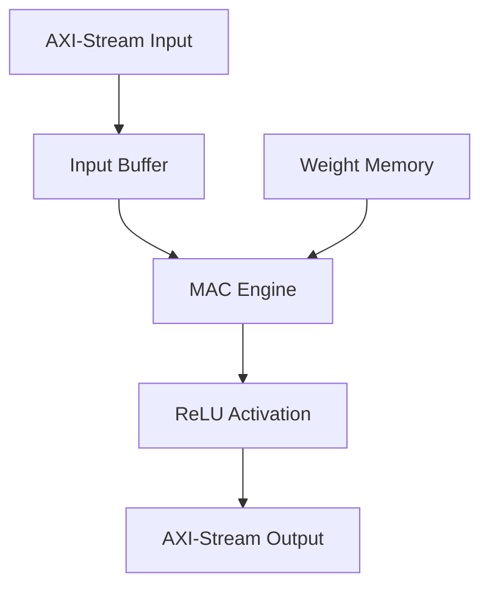

# Bit-Serial Neural Computation Engine: Architecture

## Overview
The Bit-Serial Neural Computation Engine is a high-efficiency hardware accelerator designed for neural network inference using bit-serial arithmetic. By processing data bit-by-bit, the engine significantly reduces hardware resource consumption (LUTs and Registers) while maintaining high precision and scalability.

## Core Methodology: Bit-Serial Computation
Traditional bit-parallel multipliers consume massive amounts of FPGA resources. This engine utilizes **Bit-Serial Multiplication**, where:
1.  **Iterative Processing**: Multiplications are performed over multiple clock cycles.
2.  **Resource Efficiency**: A single bit-multiplier can handle any bit-width by increasing the cycle count.
3.  **Scalability**: Easily scales the number of processing elements (PEs) without a linear increase in routing complexity.

## System Architecture

### 1. Bit-Serial Neural Network (`bitserial_nn.sv`)
The top-level module that orchestrates the entire computation flow. It handles the AXI-Stream interface for input/output and manages the layer-by-layer execution.

### 2. Input Buffer (`input_buffer.sv`)
Responsible for:
*   Receiving high-speed AXI-Stream data.
*   Packing and storing input features into a bit-serial compatible format.
*   Synchronizing data flow with the MAC engine.

### 3. MAC Engine (`mac_engine.sv`)
The heart of the accelerator. It contains the bit-serial processing elements that perform the Multiply-Accumulate operations. Its design allows for flexible precision settings.

### 4. Weight Memory (`wmem_hidden.sv`)
A specialized memory structure (BRAM optimized) that stores neural network weights. It is designed for parallel weight readout to feed multiple bit-serial units simultaneously.

### 5. ReLU Activation (`relu_activation.sv`)
Hardware implementation of the Rectified Linear Unit. It processes the high-precision output of the MAC engine and prepares it for the next layer or final output.

## Technical Specifications
*   **Interface**: AXI-Stream (Slave for input, Master for output).
*   **Arithmetic**: Signed bit-serial multiplication.
*   **Scalability**: Configurable input vector size (`N_IN`) and hidden layer size (`N_HIDDEN`).
*   **Parallelism**: Parameterized parallelism factor (`P`) for performance tuning.

## Data Flow Diagram

