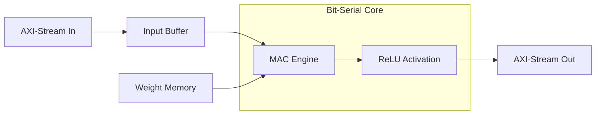

# Bit-Serial Neural Computation Engine

A high-efficiency, resource-optimized Neural Network Computation Engine implemented in SystemVerilog, leveraging **Bit-Serial Arithmetic** to minimize hardware footprint while maintaining high precision.

---

## 🏆 Introduction
This project was presented and declared a **winning presentation** in the VLSI Hackathon held at NIT Jamshedpur in December 2025. The core innovation lies in the use of bit-serial processing elements, which allow for a significant reduction in FPGA LUT and Register usage compared to traditional bit-parallel architectures.

---

## 🚀 Key Features
*   **Bit-Serial Multipliers**: Dramatically reduces hardware area (Multipliers/DSP slices).
*   **AXI-Stream Compliant**: Seamlessly integrates into standard SoC and FPGA workflows.
*   **Parameterized Architecture**: Easily configure input size (`N_IN`), hidden layers (`N_HIDDEN`), and arithmetic precision (`DATA_W`).
*   **On-Chip Activation**: Integrated ReLU activation layer for end-to-end inference support.
*   **Scalable Memory**: BRAM-optimized weight and activation storage.

---

## 🛠 Project Structure
The engine is composed of five specialized modules:

1.  **`bitserial_nn.sv`**: The top-level orchestrator that manages data flow and layer synchronization.
2.  **`mac_engine.sv`**: The core computational block performing bit-serial Multiply-Accumulate operations.
3.  **`input_buffer.sv`**: Handles input data packing and synchronization from the AXI-Stream interface.
4.  **`wmem_hidden.sv`**: Optimized weight storage with parallel readout capabilities.
5.  **`relu_activation.sv`**: Implements the ReLU activation function in hardware.

---

## 📐 Architecture Overview
The engine processes neural network layers sequentially, using bit-serial units to calculate activations. This approach is ideal for edge AI and resource-constrained FPGA applications.

For a deeper technical dive, please see [ARCHITECTURE.md](file:///d:/GitHub/my_repo/Bit-Serial_Neural_Computation_Engine/ARCHITECTURE.md).

---

## 🚦 Getting Started

### Prerequisites
*   **FPGA Tools**: Vivado (2020.1+), QuestaSim, or Icarus Verilog.
*   **Hardware**: Xilinx/Intel FPGA with sufficient BRAM resources.

### Running Simulation
1.  Navigate to the `behav_simulation` directory.
2.  Add all files from the `src` directory to your simulation project.
3.  Run the testbench `tb_bitserial_nn.sv`.

---

## 🤝 Contributing
We welcome contributions! Please see [CONTRIBUTING.md](file:///d:/GitHub/my_repo/Bit-Serial_Neural_Computation_Engine/CONTRIBUTING.md) for guidelines on how to get involved.

---

## 📜 License
This project is licensed under the **Apache License 2.0**. See the [LICENSE](file:///d:/GitHub/my_repo/Bit-Serial_Neural_Computation_Engine/LICENSE) file for details.

---

## ⭐ Credits
*   Presented at **VLSI Hackathon, NIT Jamshedpur (Dec 2025)**.
*   Upload includes the winning presentation: `IAC Hackathon ppt - Bitserial Neural Computation Engine (1).pdf`.

---
*Stay tuned for more updates and hardware implementation results!*
